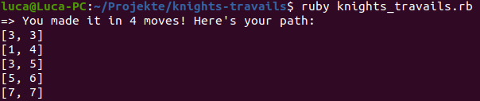

# knights-travails
## Description
Ruby programm to show how a knight on a given field can reach any other given field on a chessboard.  
The returned Arrays containing 2 integers are coordinates on the chessboard.
## Demo

## Screenshots

